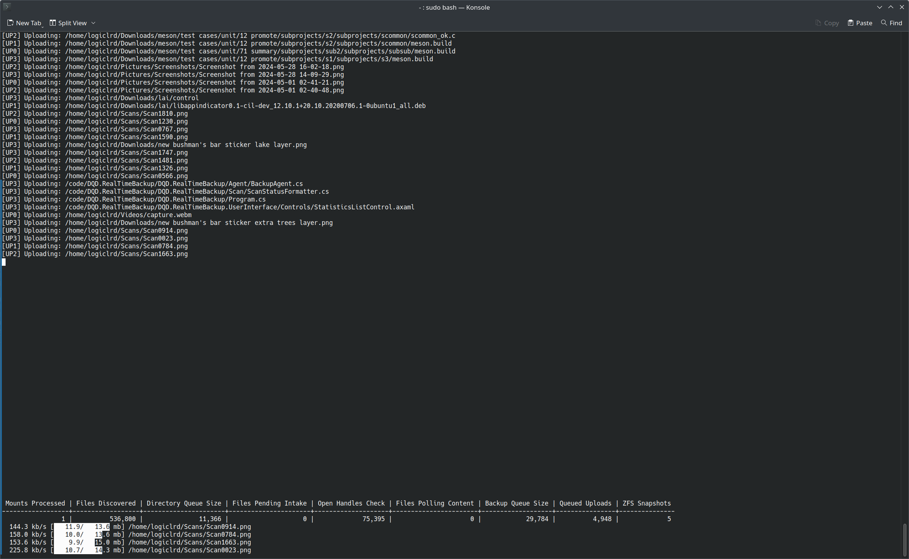
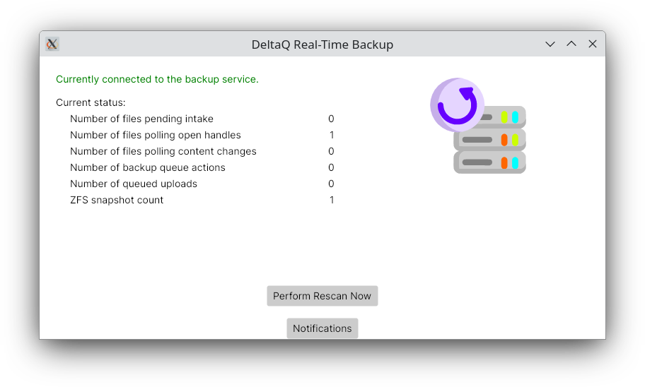
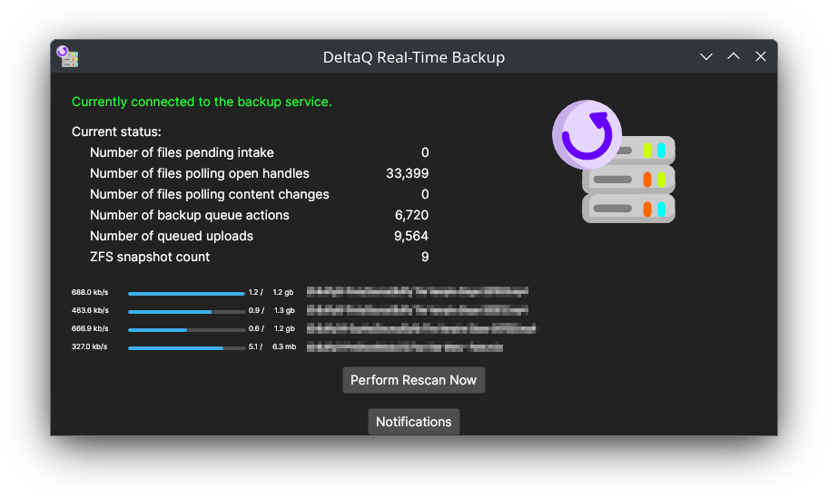

# DQD.RealTimeBackup

## Introduction


DQD.RealTimeBackup is a real-time backup solution for Linux systems using ZFS specifically. It uses `fanotify` to monitor for changes in the filesystem and ZFS snapshots to improve consistency in its operations, and it stores files in Backblaze B2 cloud storage. It was written to provide functionality akin to Backblaze back-up, which is available for Windows and OS X but not for Linux. It can be configured to run as a system service using `systemd`.

## How To Use

By default, DQD.RealTimeBackup reads its configuration from an XML file with the path `/etc/DQD.RealTimeBackup.xml`. At a bare minimum, you need to populate this file with credentials for your B2 account and the identifier for a B2 bucket in which files will be stored. This bucket should not be shared with anything else. A minimal configuration file looks like this:
```
<?xml version="1.0" encoding="utf-8"?>
<OperatingParameters xmlns:xsi="http://www.w3.org/2001/XMLSchema-instance" xmlns:xsd="http://www.w3.org/2001/XMLSchema">
  <RemoteStorageKeyID>00.....................01</RemoteStorageKeyID>
  <RemoteStorageApplicationKey>K0...........................KU</RemoteStorageApplicationKey>
  <RemoteStorageBucketID>d5....................11</RemoteStorageBucketID>
</OperatingParameters>
```
Check out the "Configuration" section for more detailed configuration options.

Before engaging the real-time backup functionality, you will need to complete an initial back-up. This is intended to be run in an interactive terminal, so that you can observe its progress.

DQD.RealTimeBackup is written in C# against .NET 8.0. When compiled, it produces output with files named `*.dll` which are executed using a binary called `dotnet`. (It is possible to set up stubs to automate this process and give the program a "friendly" command name, but as of this writing this hasn't been done for the DQD.RealTimeBackup project.)

### Initial Backup



In order to run DQD.RealTimeBackup and perform an initial backup, you can use one of these two command-line options:
```
  dotnet DQD.RealTimeBackup.dll /INITIALBACKUPTHENEXIT
  dotnet DQD.RealTimeBackup.dll /INITIALBACKUPTHENMONITOR
```
You may also wish to supply the `/VERBOSE` command-line option to get more detailed output. The volume of output will be utterly overwhelming, but if problems arise there will be more detail to inspect and diagnose.

### Running as Background Service

Once the initial backup is complete, you can run DQD.RealTimeBackup in monitoring mode. In this mode, it registers with the kernel to receive notifications about files being changed, and will immediately propagate such changes from your computer up to the B2 bucket storing the files. You can run it in monitoring mode in a terminal window, but you will probably ultimately want it to be running as a system service so that it is always operating in the background even after restarting.

To register DQD.RealTimeBackup.dll as a system service, inspect the file `DQD.RealTimeBackup.service` that ships with the release. Ensure that the paths in it make sense and modify the command-line as needed. (It is not recommended to configure the system service to engage Initial Backup mode.) Then, copy the file to the path:

* `/etc/systemd/system`

Reload the `systemd` daemon with the command:
```
  systemctl daemon-reload
```
Then you can start the service:
```
  systemctl start DQD.RealTimeBackup
```
It is recommended that you briefly monitor the log file to ensure that it is in fact operating.

## Monitoring


An applet called DQD.RealTimeBackup.UserInterface adds a system tray icon and can display ongoing statistics about the operation of DQD.RealTimeBackup. This application uses the Avalonia library to present its user interface.

<br clear="both" />


DQD.RealTimeBackup.UserInterface handles light and dark themes automatically. In this screenshot, an initial backup is underway.

<br clear="both" />

There is also a command-line tool DQD.RealTimeBackup.Console that can connect to a running Backup Agent and retrieve its current operating state and statistics. This tool can also submit paths to be processed and pause/unpause filesystem monitoring.
```
logiclrd@visor:/code/DQD.RealTimeBackup/DQD.RealTimeBackup.Console$ dotnet run
usage: /code/DQD.RealTimeBackup/DQD.RealTimeBackup.Console/bin/Debug/net8.0/DQD.RealTimeBackup.Console.dll
    [/CONNECT <value>] [/GETSTATS] [/GETSTATSINCLUDEUPLOADS] [/GETSTATSREPEAT]
    [/CHECKPATH [/CHECKPATH <value> [..]]] [/PAUSEMONITOR] [/UNPAUSEMONITOR] [/DISCARDBUFFEREDNOTIFICATIONS] [/XML] [/?]
logiclrd@visor:/code/DQD.RealTimeBackup/DQD.RealTimeBackup.Console$ 
```
This utility provides the following options:

* `/CONNECT` <value>: Specifies the endpoint to which to connect. Can be a UNIX socket (e.g. /run/DQD.RealTimeBackup/bridge.socket) or a TCP/IP endpoint (e.g. 127.0.0.1:12345 -- check /run/DQD.RealTimeBackup/bridge-tcp-port for the port number, which may be dynamically-assigned).
* `/GETSTATS`: Requests operating statistics from the Backup Agent.
    * `/GETSTATSINCLUDEUPLOADS`: If `false`, then detailed information about the upload threads is suppressed. Defaults to `true`.
    * `/GETSTATSREPEAT`: Gets operating statistics repeatedly in a loop until the process is terminated.
* `/CHECKPATH <value>`: Submits a file path to be checked for changes (including deletion). Can be specified multiple times.
* `/PAUSEMONITOR`: Instructs the Backup Agent to pause monitoring. If it is already paused, there is no effect.
* `/UNPAUSEMONITOR`: Instructs the Backup Agent to unpause monitoring. If it is not currently paused, there is no effect.
    * `/DISCARDBUFFEREDNOTIFICATIONS`: When using /UNPAUSEMONITOR, instructs the Backup Agent to discard any buffered paths for which events were received while paused. By default, these paths are queued for processing as soon as File Monitoring in unpaused.
* `/XML`: Write all output in XML, making it machine-readable.

## Configuration

Configuration of the core Backup Agent within DQD.RealTimeBackup is done by means of a collection of properties called `OperatingParameters`. This collection is read from an XML file in `/etc`. The full list of properties is:
```
<?xml version="1.0" encoding="utf-8"?>
<OperatingParameters xmlns:xsi="http://www.w3.org/2001/XMLSchema-instance" xmlns:xsd="http://www.w3.org/2001/XMLSchema">
  <Verbosity>Normal</Verbosity>
  <ErrorLogFilePath>/var/log/DQD.RealTimeBackup.error.log</ErrorLogFilePath>
  <EnableFileAccessNotify>true</EnableFileAccessNotify>
  <PathFilters>
    <PathFilter Type="..." Value="..." Action="Exclude" />
  </PathFilters>
  <PreferredMountPoints />
  <MonitorFileSystemTypes>
    <string>zfs</string>
  </MonitorFileSystemTypes>
  <MaximumFileSizeForStagingCopy>524288000</MaximumFileSizeForStagingCopy>
  <LSOFBinaryPath>/usr/bin/lsof</LSOFBinaryPath>
  <QueueHighWaterMark>10000</QueueHighWaterMark>
  <QueueLowWaterMark>5000</QueueLowWaterMark>
  <OpenFileHandlePollingInterval>PT4S</OpenFileHandlePollingInterval>
  <MaximumTimeToWaitForNoOpenFileHandles>PT30S</MaximumTimeToWaitForNoOpenFileHandles>
  <LongPollingInterval>PT30S</LongPollingInterval>
  <MaximumLongPollingTime>PT10M</MaximumLongPollingTime>
  <ZFSBinaryPath>/usr/sbin/zfs</ZFSBinaryPath>
  <SnapshotSharingWindow>PT5S</SnapshotSharingWindow>
  <RemoteFileStateCachePath>/var/DQD.RealTimeBackup/FileStateCache</RemoteFileStateCachePath>
  <BatchUploadConsolidationDelay>PT30S</BatchUploadConsolidationDelay>
  <UploadThreadCount>4</UploadThreadCount>
  <PeriodicRescanInterval>PT6H</PeriodicRescanInterval>
  <RemoteStorageKeyID>00.....................01</RemoteStorageKeyID>
  <RemoteStorageApplicationKey>K0...........................KU</RemoteStorageApplicationKey>
  <RemoteStorageBucketID>d5....................11</RemoteStorageBucketID>
  <B2LargeFileThreshold>10485760</B2LargeFileThreshold>
  <B2LargeFileChunkSize>5242880</B2LargeFileChunkSize>
</OperatingParameters>
```

The options are:

* `Verbosity`: Determines how much output DQD.RealTimeBackup will write to its console and the main log file. Options are `Verbose`, `Normal` and `Quiet`.
    * `Verbose` displays extended information about most things the service does. This can be useful when diagnostic problems and debugging.
    * `Normal` displays basic information about ongoing operations.
    * `Quiet` suppresses most output. Only messages that are important to the state of the service or consistency of the data are displayed.
* `ErrorLogFilePath`: Specifies where _important_ errors are written. Default: `/var/log/DQD.RealTimeBackup.error.log`
* `IPCPath`: Specifies where details needed for inter-process communication are written. Default: `/run/DQD.RealTimeBackup`
* `IPCUseUNIXSocket`: Specifies whether DQD.RealTimeBackup should listen for bridge connections on UNIX domain sockets. The socket will be named `bridge.socket` in the folder identified by `IPCPath`. Defaults to true.
* `IPCUseTCPSocket`: Specifiec whether DQD.RealTimeBackup should listen for bridge connections on a TCP endpoint. The TCP port number will be written to a file named `bridge-tcp-port` in the folder identified by `IPCPath`. Defaults to false.
* `IPCBindTCPAddress`: Allows the TCP endpoint for IPC to be bound to an address other than localhost. This can allow a remote user interface. Consider security implications before doing this. This parameter has no effect when `IPCUseTCPSocket` is not `true`.
* `IPCBindTCPPortNumber`: Allows the port number for the TCP endpoint to be fixed. By default it is dynamically-assigned. This parameter has no effect when `IPCUseTCPSocket` is not `true`.
* `EnableFileAccessNotify`: Master switch that turns realtime monitoring of the filesystem on/off.
* `PathFilters`: Collection of filters that determine which files should be considered and which should be ignored. See detailed documentation below.
* `PreferredMountPoints`: If your configuration binds the exact same devices to multiple mount points, you must pick which one should be considered the canonical mount point for each device. Specify these mount points in this collection. The values are only used when disambiguation is needed.
* `MonitorFileSystemTypes`: Determines which filesystem types should be monitored for changes. Currently, only `zfs` is supported because the Backup Agent's algorithms are heavily invested in ZFS snapshots.
* `LSOFBinaryPath`: If the path to `lsof` on your system is different, you can specify it here.
* `QueueHighWaterMark`: During an initial backup operation, if a producer encounters a queue that has reached this many items, it will pause and wait for the queue to go down in size.
* `QueueLowWaterMark`: If a producer has paused due to a queue hitting the high water mark, it will not unpause until it hits the low water mark.
* `OpenFileHandlePollingInterval`: [`TimeSpan`] Specifies how frequently to scan files for open write handles. Generally, a file will not be backed up while it is being written to.
* `MaximumTimeToWaitForNoOpenFileHandles`: [`TimeSpan`] Waiting for a file to no longer have any writers only goes on so long. After this much time has elapsed, if files continue to have file handles open for writing to them, they are transitioned to a "long polling" strategy that inspects the file contents. If the file's contents haven't changed in a long enough time, they are deemed heuristically to be "stable enough" and the file is uploaded in that state.
* `LongPollingInterval`: [`TimeSpan`] Specifies how frequently to scan file _contents_ as part of long polling.
* `MaximumLongPollingTime`: [`TimeSpan`] If a file has a writer making changes to it continuously for this long, eventually a snapshot of the file the way it presently is will be uploaded anyway. Better to put _something_ up in the cloud than nothing at all.
* `ZFSBinaryPath`: If the path to `zfs` on your system is different, you can specify it here.
* `SnapshotSharingWindow`: [`TimeSpan`] When changes are detected, there could be multiple files being changed at the same time. The Backup Agent will wait this long after the first detected change before "locking in" the changes by making a ZFS snapshot. If multiple files have changes detected during this window, they will all be captured in the same ZFS snapshot.
* `RemoteFileStateCachePath`: Allows you to override where the Remote File State Cache information is stored. Generally, this does not need to be modified. Wherever the files are stored, the path should be excluded using a `PathFilter`.
* `BatchUploadConsolidationDelay`: [`TimeSpan`] Changes to file state are tracked by the Remote File State Cache. These changes are collected in "batches" which then get uploaded to the server along with file content and ultimately consolidated into one giant file that lists all remote files. This setting specifies a delay after the Remote File State Cache is notified of a change to a file before it closes the current batch starts a new one. When many files are modified quickly, this allows their state information to be grouped into a single batch.
* `UploadThreadCount`: Maximum number of concurrent uploads that the service will do at once.
* `PeriodicRescanInterval`: [`TimeSpan`] After the initial backup is complete (which inspects every file's content from scratch), ongoing changes are captured by monitoring with `fanotify` but it is assumed that, for various reasons, there might be small inconsistencies that could build up. To counteract this, periodically, the service does a "whole system" scan, comparing the actual files against the Remote File State Cache. This scan does not check file content, only file size and last modified timestamp. This setting determines how frequently these "refreshes" are performed.
* `RemoteStorageKeyID`: The Key ID for using the Backblaze B2 API. This is provided when you configure an Application Key using "Application Keys" in the menu on the left after signing into your Backblaze account. You can use the "Add a New Application Key" button to create a new key.
* `RemoteStorageApplicationKey`: The Application Key generated for using the Backblaze B2 API. This is provided when you configure an Application Key using "Application Keys" in the menu on the left after signing into your Backblaze account. Note that the Application Key is shown only once, during key creation, and is _never_ shown again. Make sure you immediately note it down, or you will have to create another key to use the service.
* `RemoteStorageBucketID`: The Bucket ID shown under "Buckets" in the Backblaze console. This can also be obtained through the API by listing buckets. It is a 24-digit hexadecimal value that uniquely identifies the bucket within Backblaze's system.
* `B2LargeFileThreshold`: The B2 API has two different methods of uploading a file. One method uploads the entire file in one go, in one web request. It does not offer any sort of resiliency or retry functionality. If the request fails partway through, it must simply be restarted from scratch. It is also limited in size. A file whose size is less than or equal to this threshold will be uploaded using the simple single-call upload method. If the file size is larger than this setting, then the multi-part upload function will be engaged, which uses B2 APIs `b2_start_large_file`, `b2_get_upload_part_url` and then multiple calls to `b2_upload_part`, followed by `b2_finish_large_file` to convert the parts into a single file in the system.
* `B2LargeFileChunkSize`: If a file is being uploaded using the large file API, it must be divided into chunks. This setting controls the size of these chunks.

### `TimeSpan` Format

Values marked `TimeSpan` are in a format that is part of the XML specification for representing Duration values. There are various references for this format on the web. Here are a couple:

* [https://www.tutorialspoint.com/xsd/xsd_datetime.htm](https://www.tutorialspoint.com/xsd/xsd_datetime.htm)
* [https://www.w3schools.com/xml/schema_dtypes_date.asp](https://www.w3schools.com/xml/schema_dtypes_date.asp)

The format is defined in the XML Schema specification here:

* [https://www.w3.org/TR/xmlschema-2/#duration](https://www.w3.org/TR/xmlschema-2/#duration)

## Restoring Files

A backup system is only useful if there is a way to get the files back. For this purpose, DQD.RealTimeBackup supplies a utility called DQD.RealTimeBackup.Restore.
```
root@visor:/srv/DQD.RealTimeBackup# dotnet DQD.RealTimeBackup.Restore.dll /?
usage: dotnet DQD.RealTimeBackup.Restore.dll [/CONFIG <value>] [/LISTALLFILES] [/RECURSIVE] 
    [/LISTDIRECTORY <value> [/LISTDIRECTORY <value> [..]]] [/RESTOREFILE <value> [/RESTOREFILE <value> [..]]] 
    [/RESTOREDIRECTORY <value> [/RESTOREDIRECTORY <value> [..]]] [/RESTORETO <value>] [/CATFILE <value>] [/XML] [/?]
root@visor:/srv/DQD.RealTimeBackup# 
```
This utility provides the following options:

* `/CONFIG <path>`: Allows you to specify a non-default path for the XML configuration file that sets up `OperatingParameters` for the DQD.RealTimeBackup system. If not specified, this defaults to: `/etc/DQD.RealTimeBackup.xml`
* `/LISTALLFILES`: Communicates with the Backblaze B2 endpoint to retrieve the list of content pointer files (whose names match the source files on your computer). This identifies every file that could potentially be restored.
* `/LISTDIRECTORY <path>`: Communicates with the Backblaze B2 endpoint to retrieve a subset of the list of content pointer files. This subset is all of the files contained within the supplied directly (i.e., whose paths start with the specified path). By default, only files directly in the directory are returned. In order to list files in subdirectories, specify the `/RECURSIVE` option. The `/LISTDIRECTORY` argument can be supplied multiple times. If `/RECURSIVE` is supplied, it applies to all `/LISTDIRECTORY` arguments.
* `/RESTOREFILE <path>`: Restores the specified file. By default, the file is written to a subdirectory of the current working directory. For instance, if you restore the file `/Projects/Video/Cabana/Cabana.kdenlive` and you run the command from `/home/username`, then the restored file will be written as `/home/username/Projects/Video/Cabana/Cabana.kdenlive`. You can control this with the `/RESTORETO` argument. The `/RESTOREFILE` argument can be specified multiple times.
* `/RESTOREDIRECTORY <path>`: Restores all files in the specified directory. The path for each restored file is determined in the same way as for the `/RESTOREFILE` argument. By default, only files directly in the specified directory are returned. In order to restore an entire subtree, specify the `/RECURSIVE` option. The `/RESTOREDIRECTORY` argument can be specified multiple times.
* `/RESTORETO <path>`: Specifies the base path for restored files. File paths are built relative to the specified path. For instance, if you specify `/RESTORETO /Restores` and you are restoring a file called `/Documents/Taxes/2023.ods`, then the restored file will be written to `/Restores/Documents/Taxes/2023.ods`.
* `/CATFILE <path>`: Restores the specified file and writes its content directly to standard output. This could allow it to be piped into another command.
* `/XML`: Makes the output from DQD.RealTimeBackup.Restore machine-readable. The output from commands (other than `/CATFILE`) is streamed an XML that can be read in realtime with an XML reader in another process.

## Operating Principles

The Backup Agent that drives the operation of DQD.RealTimeBackup has a sequence of stages through which a file passes as the appropriate operation is determined.

* `Intake`: Files are gathered in batches to be passed off for open file handles checks.
* `Poll Open Files`: The first stage of checking for eligibility involves creating a ZFS snapshot (which may apply to multiple files simultaneously), and then querying the system for open file handles. Files that have no handles open for writing are considered stable and are promoted to the next stage. Files that continue to have writers for too long eventually get shunted to the `Poll File Content` stage.
* `Poll File Content`: A more intensive and slower process is engaged if a file is observed being written to (i.e., file descriptors whose access allows writing are present) for more than a certain cutoff. In this mode, a second ZFS snapshot is made and the file content in the first snapshot is compared to the file content in the second snapshot. If the file is identical in both snapshots, then it is heuristically deemed "good enough" to upload to the backup bucket. Also, if enough time passes, then a file will be backed up even if its content is being changed. The backup is uploaded from a ZFS snapshot, so changes over time won't be merged into a mangled monster file. It is possible, though, for the file's producer to be in the middle of a sequence of writes to produce a consistent state. However, it would have to block for an extended time in order for the file content to be registered as identical in two different snapshots.
* `Backup Action Queue`: This queue represents actions that the Backup Agent has decided to take. There are three kinds of action: Upload File, Move File and Delete File. Move File and Delete File are performed directly. Upload File actions are passed off to a final stage.
* `Upload Threads`: These threads (by default 4 of them will be created to run in parallel) take references to a file in a ZFS snapshot and upload the content as of that snapshot to B2 storage.

The B2 API does not support renaming or moving files. In order to efficiently support moving files, they are stored with a layer of indirection in the B2 bucket. The actual file content is assigned a `content key`, which is a 128-digit random alphanumeric string, and then a _pointer_ file named `/content/path/to/file` is written that contains the `content key`. In order to move a file, the pointer file can be deleted, and a new pointer file written, without having to alter the actual file data at all. This does mean that to download a file, two download operations are needed, and to delete a file, a download and two deletions are needed.

## Contributing

If you want to contribute to the DQD.RealTimeBackup project, you can engage the development effort with GitHub Issues on the project at the following path:

https://github.com/logiclrd/DQD.RealTimeBackup/

If you have an actual change that could be useful, you can create a Pull Request. Make sure your code is clean, consistent, follows the file's formatting standards and is well-tested.

### Donations

As of the start of July, this project and related development that it triggered sum up to approximately 27K lines of source code, and that development work took me approximately 70 hours to do. I am currently starting a business and do not have a reliable income. If you think this work is valuable and you are in a position to throw a few bars of gold-pressed latinum my way, donations are gratefully accepted.

[](https://www.paypal.com/donate/?hosted_button_id=Z975BCMGRLY5Y)

Bitcoin: 35JLznP5VQtksnuiudnxg18cXL7kqHopxo

Anything helps!

### Dependencies

This library uses a couple of external libraries in its implementation:

* `DQD.CommandLineParser`: Command-line parsing the way it _should_ be. [https://github.com/logiclrd/DQD.CommandLineParser/](https://github.com/logiclrd/DQD.CommandLineParser/)
* `Autofac`: Inversion of Control / Dependency Injection. I like the way this particular library works.
* `Backblaze.Client`: A C# wrapper of the Backblaze B2 API.
* `Avalonia`: Cross-platform user interface library with the same general feel as WPF. [https://avaloniaui.net/](https://avaloniaui.net/)
* Testing stack:
    * `NUnit` version 4.1.0
    * `NSubstitute`
    * `Bogus`
    * `AutoBogus`
    * `FluentAssertions`

## Icon

The icon image used by DQD.RealTimeBackup.UserInterface is based on the following free icon:

<a href="https://www.flaticon.com/free-icons/backup" title="backup icons">Backup icons created by Freepik - Flaticon</a>
